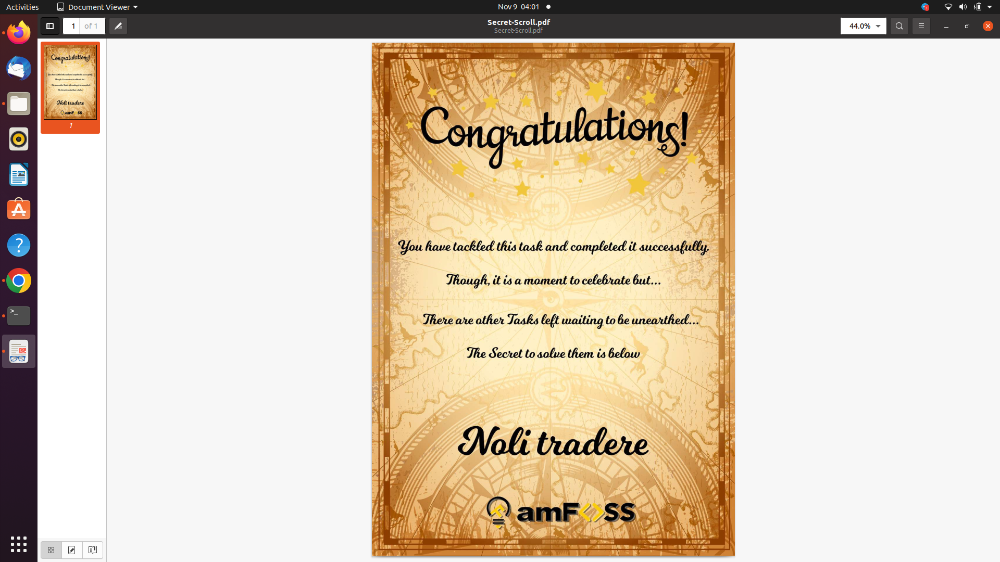

# Terminal Hunt
The commands I used here were as follows:
1. git clone https://github.com/gauthamk02/TerminalHunt.git (Cloning repo to local)
2. mkdir solution (Create a folder named solution)
3. cd solution, cat > part1.txt (Moving to solution folder and create a file part1.txt and enter the answer)
4. cat > part2.txt (Create a file part2.txt and enter answer)
5. git log, cp ../10/1.txt ./, mv 1.txt part3.txt (Check Commit history,Copy 1.txt from folder 10 to solution folder, Rename 1.txt to part3.txt)
6. git add . , git commit -m "Task Commit" (Add all files, Commit with commit message as Task Commit)
7. git branch -a, git checkout asia
8. find . -athens.txt
9. git checkout main, git merge asia, cp ./NewFolder/Greek-Empire/athens.txt ./solution/ , mv athens.txt part4.txt (merging asia branch and main branch, copy athens.txt to solution and rename it as part4.txt)
10. cat part1.txt>password.txt, cat part2.txt >> password.txt, cat part3.txt >> password.txt, cat part4.txt >> password.txt (Create password.txt file and concatenating all other 4 files in solution directory to password.txt)
11. tr -d '\n' < password.txt (Removing new line if any present in password.txt)
12. rm part1.txt part2.txt part3.txt part4.txt (Delete files part1.txt, part2.txt, part3.txt, part4.txt)

Screenshot of the pdf file is attached in the folder.

